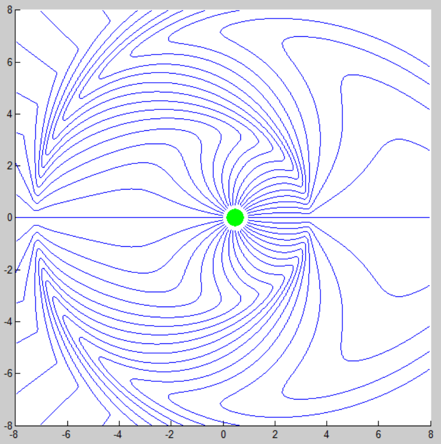

# Animation of the Electric Field of a Moving Charge

MATLAB animation of the evolution of the electric field of a moving charge, which is the derivative of the retarded potential or Liénard–Wiechert potential.

The project is initiated for a visualization and intuitive understanding of related physics concepts after completing the undergraduate course _Electromagnetics_ (by [Qing Wang](http://www.phys.tsinghua.edu.cn/publish/phyen/6033/2011/20110317100225032103716/20110317100225032103716_.html)) in Jun, 2012, and is modified in Dec., 2012 for a MATLAB course.

## Details:
* Animation is implemented by the `getframe` and `movie` APIs in MATLAB, where the first captures and saves each frame of the electric field at each moment, which is plotted by the `streamline` API, and the second animates the stored frames.

* "[doc.pdf](./doc.pdf)": the document detailing related physics theory, algorithms and implementations (in Chinese).

* "[ElecField.m](./ElecField.m)": the main file for implementation and execution.

* "[NewSubs.m](./NewSubs.m)": auxiliary file for extending the built-in `subs` function to return an array (instead of a scalar) when the to-be-substituted function is constant.

## Usage:
Run `ElecField(T, type, k)` in the MATLAB console, where:
* `T` is the lasting time of the animation;
* `type` is the type of the motion of the charge (currently supports `'line'`, `'harmonic'`, and `'circle'`);
* `k` is the ratio of the maximum moving speed against the speed of the light (taken as 1).

The following is a snapshot at some moment during running `ElecField(10, 'harmonic', 0.8)`.

